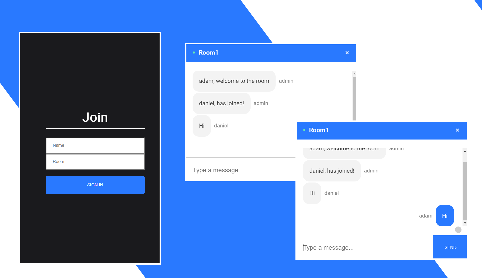

# Chat-Application
Using React to create a realtime chat application with Node.js and socket.io. This project was a practice for using React on the front end, NodeJS and Socket.io web socket library on the back end. This gave me a better understanding of how to send and receive messages using web sockets and Socket.io. 

## Functionality

